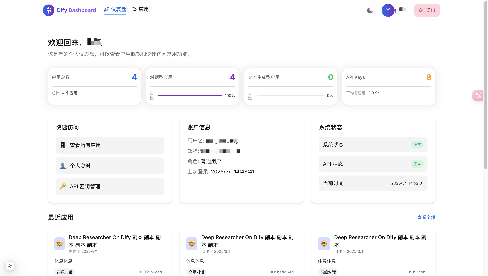
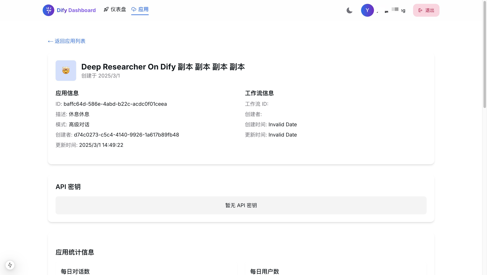

# Dify Dashboard

<div align="center">
Dify Dashboard
</div>

<p align="center">
  <strong>简单，轻巧，快速的 Dify 应用管理控制台</strong>
</p>

<p align="center">
  <a href="https://github.com/huixiangyang/dify-dashboard" target="_blank">
    
  </a>
  
  
</p>

## 项目介绍

Dify Dashboard 是一个现代化的 Dify 应用管理控制台，为 Dify 用户提供了一个简单、轻巧、快速的方式来管理和监控他们的 AI 应用。通过直观的界面和丰富的功能，用户可以轻松地查看应用统计数据、管理 API 密钥、监控 Token 使用情况等。

### 主要特点

- **现代化界面**：采用 HeroUI 和 Next.js 构建的现代化界面，提供流畅的用户体验
- **应用管理**：轻松查看和管理所有 Dify 应用
- **统计数据**：直观展示应用使用情况、Token 消耗和成本统计
- **API 密钥管理**：便捷管理应用的 API 密钥
- **响应式设计**：完美适配桌面和移动设备
- **自动 Token 刷新**：内置智能 Token 刷新机制，确保 API 请求不中断

## 技术栈

- [Next.js 15](https://nextjs.org/) - React 框架
- [HeroUI v2](https://heroui.com/) - UI 组件库
- [Tailwind CSS](https://tailwindcss.com/) - CSS 框架
- [TypeScript](https://www.typescriptlang.org/) - 类型安全
- [Recharts](https://recharts.org/) - 数据可视化
- [Framer Motion](https://www.framer.com/motion/) - 动画效果

## 项目结构

```
dify-dashboard/
├── app/                  # Next.js 应用目录
│   ├── apps/             # 应用管理页面
│   ├── dashboard/        # 仪表盘页面
│   ├── signin/           # 登录页面
│   └── page.tsx          # 首页
├── components/           # 可复用组件
├── config/               # 配置文件
├── contexts/             # React 上下文
├── public/               # 静态资源
├── services/             # API 服务
│   ├── http-client.ts    # HTTP 客户端服务
│   ├── api.ts            # API 接口
│   ├── auth.ts           # 认证服务
│   ├── apps.ts           # 应用管理服务
│   └── statistics.ts     # 统计数据服务
└── styles/               # 全局样式
```

## 🚀 快速开始

```bash
# 克隆仓库
git clone https://github.com/huixiangyang/dify-dashboard.git

# 进入项目目录
cd dify-dashboard

# 安装依赖
pnpm install

# 启动开发服务器
pnpm dev
```

访问 http://localhost:3000 查看应用。


## 界面预览

### 首页


### 登录页面


### 仪表盘


### 应用列表


### 应用详情


## HTTP 客户端服务

项目使用了统一的 HTTP 客户端服务（http-client.ts）来处理所有 API 请求，实现了自动 token 刷新机制：

- **http-client.ts** - 核心 HTTP 客户端服务，处理所有 HTTP 请求和 token 刷新逻辑
- **api.ts** - 提供简化的 API 接口，调用 http-client.ts 中的方法
- **auth.ts** - 处理认证相关功能，包括 token 存储和刷新
- **apps.ts 和 statistics.ts** - 特定功能模块的 API 服务

token 刷新流程：
1. 当 API 请求返回 401 未授权错误时，系统会自动尝试刷新 token
2. 使用 refreshToken 函数调用刷新 API
3. 成功获取新 token 后，自动重试原始请求
4. 使用队列机制处理并发请求，避免多次刷新 token

## 安装与使用

### 安装依赖

```bash
pnpm install
```

### 配置 pnpm

如果你使用 pnpm，需要在 `.npmrc` 文件中添加以下内容以确保 HeroUI 组件正确安装：

```
public-hoist-pattern[]=*@heroui/*
```

添加后，重新运行 `pnpm install` 确保依赖正确安装。

### 开发环境运行

```bash
pnpm dev
```

### 构建生产版本

```bash
pnpm build
```

### 启动生产服务器

```bash
pnpm start
```

## 配置

在 `.env.local` 文件中配置 Dify API 地址：

```
NEXT_PUBLIC_API_BASE_URL=https://your-dify-api-url.com
```

## 许可证

本项目采用 [MIT 许可证](LICENSE) 开源。

## 致谢

- [Dify](https://dify.ai) - 提供强大的 AI 应用开发平台
- [HeroUI](https://heroui.com) - 提供美观的 UI 组件
- [Next.js](https://nextjs.org) - 提供强大的 React 框架
