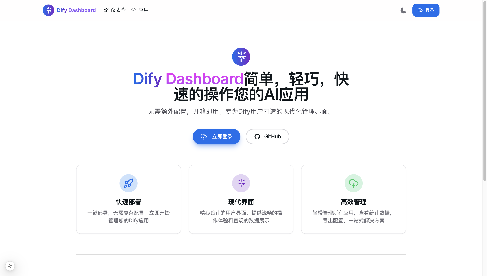
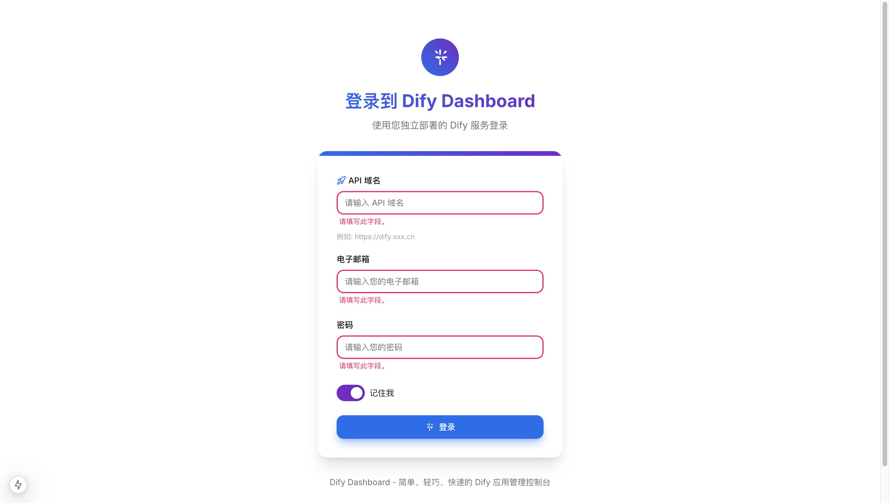
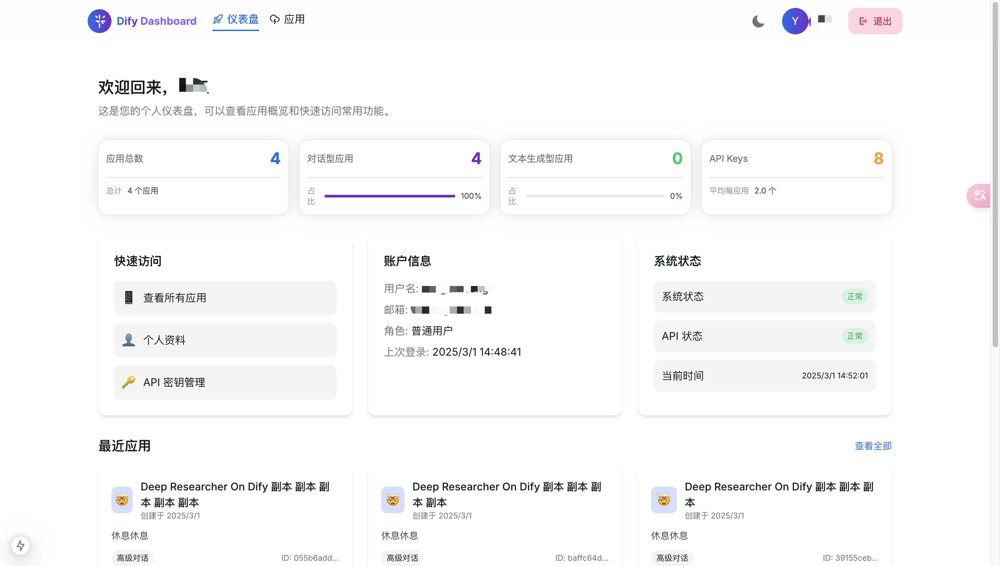
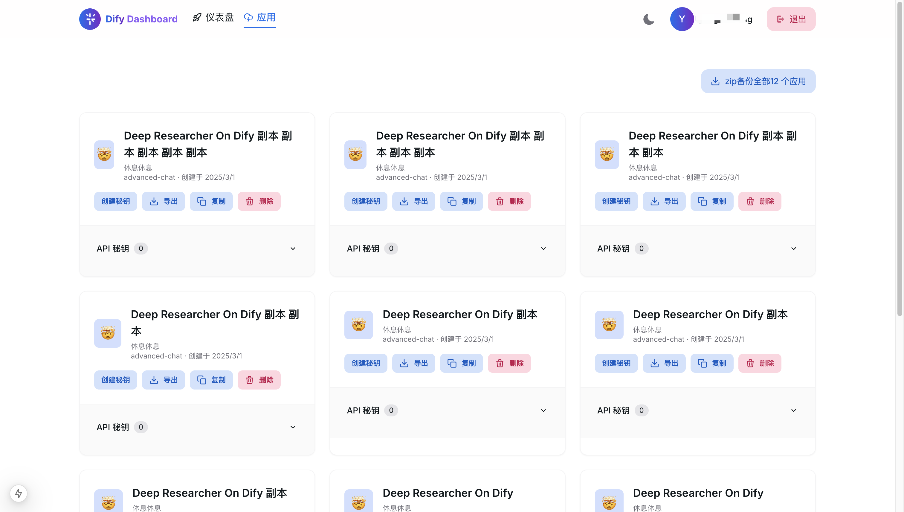
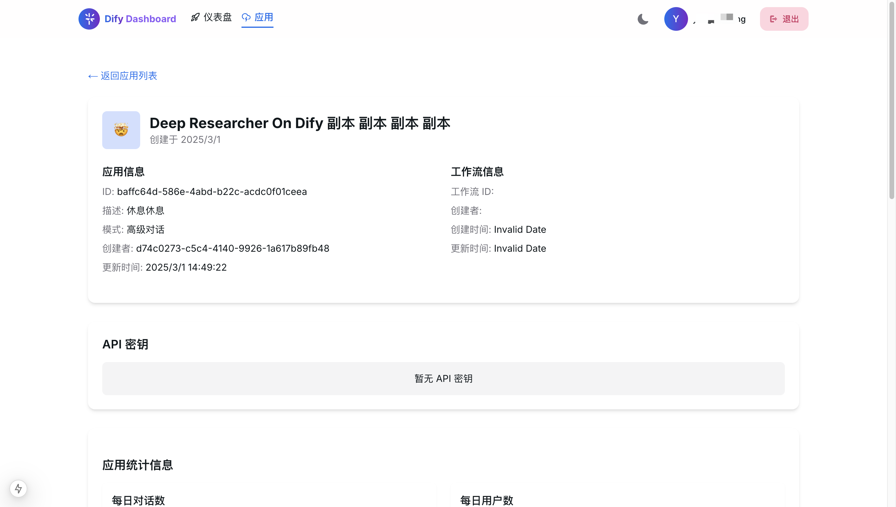

# Dify Dashboard：为您的 AI 应用提供现代化管理体验


## 引言：AI 应用管理的新时代

在当今快速发展的 AI 应用生态系统中，开发者和企业需要一个简单而强大的工具来管理他们基于 Dify 构建的 AI 应用。**Dify Dashboard** 应运而生，它是一个专为 Dify 用户打造的现代化管理控制台，提供了直观、高效的方式来监控和管理您的所有 AI 应用。

## 界面预览

### 首页


### 登录页面


### 仪表盘


### 应用列表


### 应用详情


## Dify Dashboard：简单，轻巧，快速

Dify Dashboard 的核心理念是**简单、轻巧、快速**。我们深知开发者和产品经理的时间宝贵，因此我们精心设计了一个无需复杂配置、开箱即用的管理界面，让您能够专注于创造价值，而不是浪费时间在繁琐的管理任务上。

### 主要特点

#### 1. 现代化界面

采用 HeroUI 和 Next.js 构建的现代化界面，提供流畅的用户体验。精心设计的 UI 组件和动画效果，让每一次交互都赏心悦目。响应式设计确保您可以在任何设备上高效管理您的应用。

#### 2. 全面的应用管理

- **应用概览**：一目了然地查看所有应用的状态和关键指标
- **详细统计**：深入了解每个应用的使用情况、对话数量和用户增长
- **API 密钥管理**：轻松创建、复制和删除 API 密钥
- **应用导出与复制**：一键导出应用配置或创建应用副本

#### 3. 智能数据可视化

通过精美的图表和数据可视化，直观展示应用使用趋势、Token 消耗和成本统计。支持多种时间维度的数据筛选，帮助您做出数据驱动的决策。

#### 4. 自动 Token 刷新机制

内置智能 Token 刷新机制，确保 API 请求不中断，提供无缝的用户体验：

- 当 API 请求返回 401 未授权错误时，系统自动尝试刷新 token
- 成功获取新 token 后，自动重试原始请求
- 使用队列机制处理并发请求，避免多次刷新 token

## 技术亮点

Dify Dashboard 采用了现代化的技术栈，确保高性能和良好的开发体验：

- **Next.js 15**：利用最新的 React 框架，提供出色的性能和开发体验
- **HeroUI v2**：美观现代的 UI 组件库，提供丰富的交互元素
- **TypeScript**：全面的类型安全，减少运行时错误
- **Tailwind CSS**：高效的 CSS 工具，实现精确的设计还原
- **Recharts**：强大的数据可视化库，展示直观的统计图表
- **Framer Motion**：流畅的动画效果，提升用户体验

## 使用场景

### 对于初创企业

如果您是一个初创企业，正在使用 Dify 构建 AI 产品，Dify Dashboard 可以帮助您：

- 快速部署管理界面，无需从零开始构建
- 实时监控应用使用情况，了解用户增长趋势
- 轻松管理多个应用版本，支持快速迭代

### 对于企业用户

对于企业级 Dify 用户，Dify Dashboard 提供：

- 全面的应用组合管理
- 详细的使用统计和成本分析
- 安全的 API 密钥管理
- 便捷的配置导出和备份功能

### 对于个人开发者

作为个人开发者，您将受益于：

- 简洁直观的界面，减少学习成本
- 快速访问所有应用和相关资源
- 方便的应用复制和导出功能，便于实验和迭代

## 快速开始

开始使用 Dify Dashboard 非常简单：

```bash
# 克隆仓库
git clone https://github.com/huixiangyang/dify-dashboard.git

# 进入项目目录
cd dify-dashboard

# 安装依赖
pnpm install

# 启动开发服务器
pnpm dev
```

访问 http://localhost:3000 即可查看应用。

## 配置

在 `.env.local` 文件中配置 Dify API 地址：

```
NEXT_PUBLIC_API_BASE_URL=https://your-dify-api-url.com
```

## 立即开始使用

Dify Dashboard 是一个开源项目，您可以免费使用并根据自己的需求进行定制。

### 如何部署

我们提供了多种部署选项：

#### Vercel 一键部署（推荐）

作为 Next.js 应用，Dify Dashboard 可以无缝部署到 Vercel 平台：

1. 将代码推送到 GitHub 仓库
2. 在 Vercel 中导入该仓库
3. 配置环境变量 `NEXT_PUBLIC_API_BASE_URL`
4. 点击部署

#### Cloudflare Pages 部署

Cloudflare Pages 提供全球 CDN 和自动 HTTPS：

1. 安装 Cloudflare Adapter：`pnpm add @cloudflare/next-on-pages`
2. 添加构建脚本到 package.json
3. 使用 `pnpm pages:build` 构建
4. 使用 `pnpm pages:deploy` 部署

#### Docker 部署

支持容器化部署：

```bash
# 构建镜像
docker build -t dify-dashboard .

# 运行容器
docker run -p 3000:3000 -e NEXT_PUBLIC_API_BASE_URL=https://your-dify-api-url.com dify-dashboard
```

#### 传统服务器部署

也可以在传统服务器上部署：

```bash
# 安装依赖
pnpm install

# 构建项目
pnpm build

# 启动生产服务器
pnpm start
```

详细的部署指南请参考我们的 [部署文档](./deployment-guide.md)。

## 结语：AI 应用管理的未来

随着 AI 应用的普及，高效的管理工具变得越来越重要。Dify Dashboard 致力于提供最佳的管理体验，帮助您充分发挥 Dify 平台的潜力。无论您是刚刚开始 AI 应用开发之旅，还是已经拥有多个成熟的应用，Dify Dashboard 都能满足您的需求。

我们期待看到您如何使用 Dify Dashboard 来管理和扩展您的 AI 应用。欢迎访问我们的 [GitHub 仓库](https://github.com/huixiangyang/dify-dashboard)，了解更多信息或贡献代码。

---

*Dify Dashboard 是一个开源项目，采用 MIT 许可证。我们感谢 Dify、HeroUI 和 Next.js 等开源项目的支持。*

*本项目由 Windsurf IDE 和 Claude 3.7 AI 助手强力驱动，从构思到完成仅用时 2 天。*
