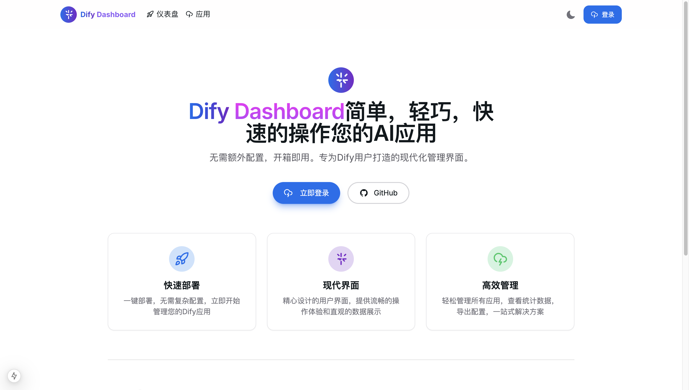
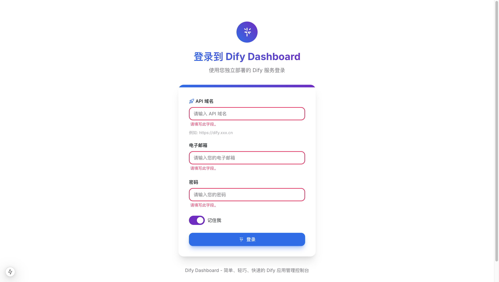

# Dify Dashboard：从构思到实现的开发历程

> **开发环境**：本项目全程使用 Windsurf IDE 和 Claude 3.7 AI 助手进行开发，总用时仅 2 天 —— 第一天完善想法和规划，第二天进行实际编码和调试。借助 AI 辅助编程，我们大幅提高了开发效率，同时保持了代码质量。

## 项目背景与初衷

作为 Dify 平台的用户，我们发现虽然 Dify 提供了强大的 AI 应用开发能力，但在管理多个应用时，原生界面还有优化空间。我们希望创建一个更现代、更高效的管理界面，让 Dify 用户能够更轻松地管理他们的 AI 应用。这就是 Dify Dashboard 项目的起源。

## 项目界面预览

### 首页


### 登录页面


### 仪表盘


### 应用列表


### 应用详情


## 技术选型考量

在开始开发之前，我们进行了深入的技术选型评估：

### 为什么选择 Next.js？

1. **服务器端渲染 (SSR)**：提供更好的首屏加载性能和 SEO 优化
2. **API 路由**：简化后端 API 的开发
3. **文件系统路由**：直观的页面组织方式
4. **TypeScript 支持**：提供出色的类型安全

我们特别选择了 Next.js 15，以利用其最新的性能优化和开发体验改进。

### UI 框架选择

在评估了多个 UI 框架后，我们选择了 HeroUI：

1. **现代美观**：符合当前设计趋势的组件库
2. **轻量级**：不会显著增加应用体积
3. **可定制性**：易于根据项目需求进行调整
4. **与 Tailwind CSS 集成**：可以无缝使用 Tailwind 的工具类

## 架构设计

### 前端架构

我们采用了模块化的架构设计，将应用分为以下几个主要部分：

1. **页面组件**：位于 `app` 目录，负责整体页面布局和路由
2. **UI 组件**：位于 `components` 目录，可复用的界面元素
3. **服务层**：位于 `services` 目录，处理 API 请求和数据处理
4. **上下文**：位于 `contexts` 目录，管理全局状态
5. **工具函数**：位于 `utils` 目录，提供通用功能

### HTTP 客户端设计

项目的一个核心亮点是我们设计的 HTTP 客户端服务，它提供了强大的功能：

```typescript
// 核心 HTTP 客户端架构
services/
  ├── http-client.ts    # HTTP 客户端核心
  ├── api.ts            # API 接口抽象
  ├── auth.ts           # 认证服务
  ├── apps.ts           # 应用管理服务
  └── statistics.ts     # 统计数据服务
```

特别是，我们实现了自动 token 刷新机制：

1. 当 API 请求返回 401 未授权错误时，系统自动尝试刷新 token
2. 使用 refreshToken 函数调用刷新 API
3. 成功获取新 token 后，自动重试原始请求
4. 使用队列机制处理并发请求，避免多次刷新 token

## 开发过程中的挑战与解决方案

### 挑战一：服务器端渲染与客户端 API 的协调

在开发过程中，我们遇到了服务器端渲染 (SSR) 与客户端 API 不兼容的问题，特别是在使用 localStorage 和 document API 时。

**解决方案**：

1. 使用 useEffect 钩子确保代码只在客户端执行
2. 添加服务器/客户端环境检测

```typescript
// 安全地访问客户端 API 的示例
const getStoredToken = () => {
  if (typeof window === 'undefined') return null;
  
  try {
    return localStorage.getItem('access_token');
  } catch (error) {
    console.error('访问 localStorage 时出错:', error);
    return null;
  }
};
```

3. 对于需要在组件初始化时访问客户端 API 的场景，我们使用了状态初始化模式：

```typescript
const [apiDomain, setApiDomain] = useState('');

useEffect(() => {
  // 在客户端环境中安全地获取存储的域名
  const storedDomain = getApiDomain();
  if (storedDomain) {
    setApiDomain(storedDomain);
  }
}, []);
```

### 挑战二：类型安全与 API 响应处理

确保整个应用的类型安全是一个挑战，特别是在处理来自外部 API 的响应时。

**解决方案**：

1. 为所有 API 响应定义明确的接口

```typescript
// API 响应类型定义示例
export interface AppsResponse {
  data: AppData[];
  total: number;
  page: number;
  limit: number;
  has_more: boolean;
}

export interface AppData {
  id: string;
  name: string;
  icon: string;
  icon_background: string;
  description: string;
  created_at: string;
  // ...其他字段
}
```

2. 使用 TypeScript 泛型增强 HTTP 客户端的类型安全

```typescript
export async function fetchWithTokenRefresh<T = any>(
  url: string,
  options: RequestInit = {},
  requireAuth: boolean = true,
): Promise<T> {
  // 实现细节...
}
```

### 挑战三：自定义图标系统

为了保持设计一致性，我们需要一套统一的图标系统，但现有的图标库不能完全满足我们的需求。

**解决方案**：

我们创建了自定义图标组件，定义在 `components/icons.tsx` 文件中：

```typescript
// 自定义图标组件示例
export const SparklesIcon = ({ className = "", size = 24, ...props }) => (
  <svg
    className={className}
    width={size}
    height={size}
    viewBox="0 0 24 24"
    fill="none"
    xmlns="http://www.w3.org/2000/svg"
    {...props}
  >
    {/* SVG 路径 */}
  </svg>
);
```

这使我们能够：
- 保持设计一致性
- 优化图标大小
- 轻松自定义图标属性

## 性能优化策略

### 代码分割

我们利用 Next.js 的自动代码分割功能，确保只加载当前页面所需的代码。对于较大的组件，我们使用动态导入进一步优化：

```typescript
const DynamicChart = dynamic(() => import('@/components/statistics-chart'), {
  loading: () => <p>加载图表中...</p>,
  ssr: false, // 避免图表组件在服务器端渲染
});
```

### 数据获取优化

为了提高数据加载性能，我们实现了：

1. **分页加载**：只加载当前页面所需的数据
2. **缓存策略**：缓存已获取的数据，减少重复请求
3. **乐观更新**：在 UI 中立即反映用户操作，然后在后台与服务器同步

### 构建优化

在项目后期，我们遇到了一些构建问题，特别是 ESLint 和 TypeScript 类型检查错误阻止了生产构建。我们通过以下方式解决：

1. 修改 `next.config.js`，添加 `eslint.ignoreDuringBuilds: true`
2. 修复类型错误，包括：
   - 添加缺失的参数类型
   - 扩展枚举类型以包含所有使用的值
   - 修复组件属性类型错误
3. 更新 `tsconfig.json`，将 `target` 从 `es5` 更改为 `es2018`，以支持现代 JavaScript 特性

## 用户体验考量

### 保持登录状态

为了提高用户体验，我们实现了智能的登录状态管理：

1. 自动 token 刷新，避免用户频繁重新登录
2. 保存用户上次使用的 API 域名，简化再次登录流程

```typescript
// 在退出登录时保留 API 域名设置
export function clearAuth() {
  // 先保存当前的 API 域名
  const apiDomain = getApiDomain();
  
  // 清除认证信息
  removeTokens();
  
  // 重新设置 API 域名
  if (apiDomain) {
    saveApiDomain(apiDomain);
  }
}
```

### 响应式设计

我们使用 Tailwind CSS 实现了完全响应式的设计，确保应用在各种设备上都有良好的体验：

```html
<div className="grid grid-cols-1 md:grid-cols-2 lg:grid-cols-3 gap-4">
  <!-- 响应式卡片布局 -->
</div>
```

## 测试与质量保证

### 类型检查

TypeScript 为我们提供了强大的静态类型检查，帮助我们在开发阶段捕获潜在错误。

### 手动测试

我们进行了全面的手动测试，覆盖：
- 功能测试：确保所有功能正常工作
- 兼容性测试：在不同浏览器和设备上测试
- 用户流程测试：验证常见用户操作路径

## 未来计划

Dify Dashboard 仍在积极开发中，我们计划添加更多功能：

1. **更丰富的数据可视化**：添加更多图表类型和分析维度
2. **批量操作**：支持批量管理应用和 API 密钥
3. **自定义主题**：允许用户自定义界面主题和布局
4. **多语言支持**：添加更多语言的本地化支持
5. **集成测试**：实现自动化测试套件

## 结语

Dify Dashboard 的开发是一段充满挑战但也非常有收获的旅程。通过现代化的技术栈和精心的架构设计，我们创建了一个高效、美观的 AI 应用管理工具。

值得一提的是，整个项目从构思到完成仅用了 2 天时间，这在很大程度上归功于我们使用的开发工具 —— Windsurf IDE 和 Claude 3.7 AI 助手。AI 辅助编程不仅加速了代码编写过程，还帮助我们快速解决了开发中遇到的各种技术难题，特别是在处理类型错误和优化构建流程方面提供了宝贵的建议。

我们希望这个项目不仅能为 Dify 用户提供更好的管理体验，也能为其他开发者提供一些有关现代 Web 应用开发和 AI 辅助编程的见解和最佳实践。

如果您对项目感兴趣，欢迎访问我们的 [GitHub 仓库](https://github.com/huixiangyang/dify-dashboard)，贡献代码或提出宝贵建议。

## 部署指南

我们提供了多种部署选项，以满足不同用户的需求。详细的部署步骤请参考 [deployment-guide.md](./deployment-guide.md)，以下是简要概述：

### Vercel 部署（推荐）

作为 Next.js 应用，Dify Dashboard 可以无缝部署到 Vercel 平台：

1. 将代码推送到 GitHub 仓库
2. 在 Vercel 中导入该仓库
3. 配置环境变量 `NEXT_PUBLIC_API_BASE_URL`
4. 点击部署

### Cloudflare Pages 部署

Cloudflare Pages 也是一个很好的选择，提供全球 CDN 和自动 HTTPS：

1. 安装 Cloudflare Adapter：`pnpm add @cloudflare/next-on-pages`
2. 添加构建脚本到 package.json
3. 使用 `pnpm pages:build` 和 `pnpm pages:deploy` 构建和部署
4. 或者在 Cloudflare Dashboard 中配置自动部署

### Docker 部署

我们提供了 Dockerfile，支持容器化部署：

```bash
# 构建镜像
docker build -t dify-dashboard .

# 运行容器
docker run -p 3000:3000 -e NEXT_PUBLIC_API_BASE_URL=https://your-dify-api-url.com dify-dashboard
```

### 传统服务器部署

也可以在传统服务器上部署：

```bash
# 构建项目
pnpm build

# 启动生产服务器
pnpm start
```

无论选择哪种部署方式，都需要确保正确配置 `NEXT_PUBLIC_API_BASE_URL` 环境变量，指向您的 Dify API 服务地址。

---
*本文由 Dify Dashboard 开发团队撰写，旨在分享我们的开发经验和技术选择。*
